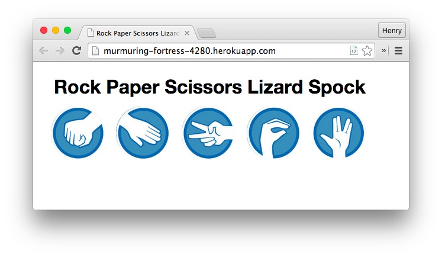

| [*Makers Academy*](http://www.makersacademy.com) | Week 7 |
| ------------------------------------------------ | ------ |

# RockPaperScissors - JS

Rock, paper, scissors, lizard, Spock – in JavaScript – from week 7 of Makers Academy.

I'm not going to lie – I had a lot of fun with [jRumble](http://jackrugile.com/jrumble/) when I made this, so it's probably not suitable for those with epilepsy.

## Technologies 

* JavaScript (front-end)
* Sinatra
* Ruby
* jQuery
* jRumble
* basic CSS